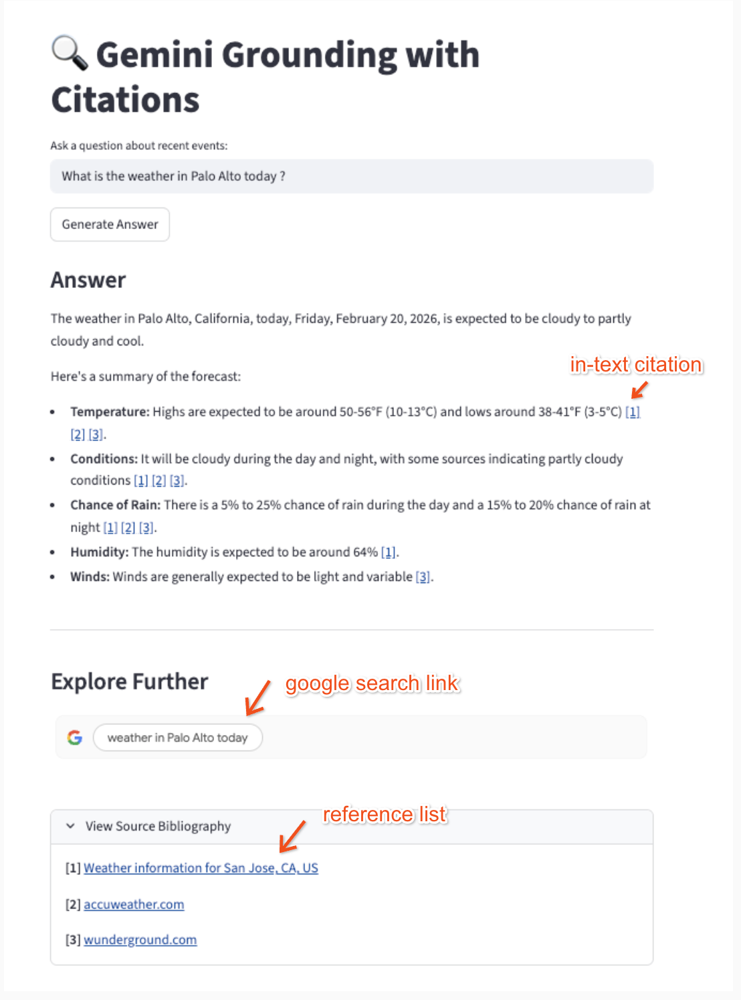

# 🔍 Gemini Search Grounding & Compliance UI

This repository contains a lightweight Python web application built with [Streamlit](https://streamlit.io/) and the official `google-genai` SDK. It demonstrates how to integrate **Google Search Grounding** with Gemini while adhering to Google's Terms of Service for display and citation compliance.

## 🚀 What It Does

When an LLM generates a response using Google Search Grounding, the API returns the generated text alongside highly specific metadata. To remain compliant and provide a good user experience, developers must handle this metadata carefully. 

This application demonstrates how to:
1. **Force Search Utilization:** Uses system instructions and a `0.0` temperature to ensure the model prioritizes real-time web data over its internal training weights.
2. **Render the Search Entry Point:** Safely extracts and renders the raw HTML/CSS provided by Google (the "Search Suggestion" chip) without altering its styling or wrapping it in forbidden click-trackers.
3. **Parse Inline Citations** Accurately maps `grounding_supports` and `grounding_chunks` into the text as clickable Markdown links (e.g., `[1]`).

## 📋 Prerequisites

Before you begin, ensure you have the following installed on your machine:
* Python 3.9 or higher
* `pip` (Python package installer)
* A valid Gemini API Key from [Google Cloud -> Vertex AI ](https://docs.cloud.google.com/vertex-ai/generative-ai/docs/start/api-keys?usertype=standard)

## 🛠️ Installation & Setup

1. Clone the repository (or create the project folder)
```bash
mkdir gemini-grounding-app
cd gemini-grounding-app
```
2. Create and activate a virtual environment (Recommended)

```bash
python3 -m venv venv
source venv/bin/activate  # On Windows use: venv\Scripts\activate
```
3. Install the required dependencies
```bash
pip install streamlit google-genai
```
🔑 Environment Variables
The google-genai SDK automatically looks for your API key in the environment variables. 

4. You must set GOOGLE_API_KEY before running the application.
```bash
export GOOGLE_API_KEY="your_actual_api_key_here"
```

▶️ Running the Application
Once your environment is set up and your API key is exported, 
5. Launch the UI from your terminal:

```bash
export GOOGLE_API_KEY="your_actual_api_key_here"
```

Streamlit will spin up a local server and automatically open the application in your default web browser (typically at http://localhost:8501).

## Sample response

